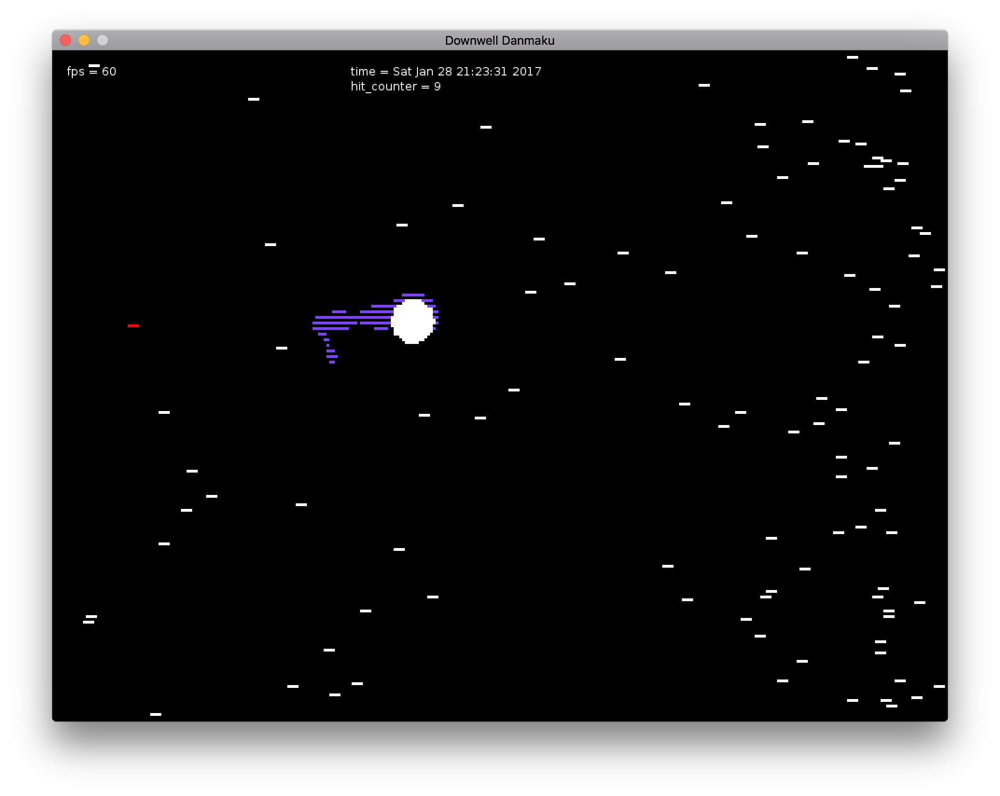

# downwell_danmaku

a really f\*\*king simple [love2d](https://love2d.org) danmaku game with [Downwell](http://store.steampowered.com/app/360740) art style



## How To Play

Clone this repository.

```bash
git clone https://github.com/hustanhuang/downwell_danmaku.git
```

Download LÖVE engine from [here](https://love2d.org). (And install it if necessary)

Run LÖVE from this repository.

```bash
cd downwell_danmaku
love .
```

## How To Play (REAL)

`W` `A` `S` `D` to move

`J` to shrink for a short time

`P` to enter the **AWESOME** bullet time

## Disclaimer
largely based on [adonaac](https://github.com/adonaac)'s blog article

uses these library (I only kept the necessary files)
- https://github.com/rxi/classic
- https://github.com/vrld/hump

(also the nyan cat music is used...)
